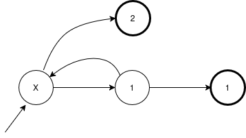
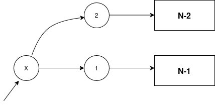

# Ladder

## Problem setting 

The objective is to rewrite the algorithm in `ladder.py`
efficiently.

A sample input is provided in `ladder.txt` 
and the optimized algorithm is `ladder_optimized.py`
which works on all test cases
and is re-written to avoid floating-point overflow.

*Link :* [https://csacademy.com/ieeextreme19/task/ladder/](https://csacademy.com/ieeextreme19/task/ladder/)

Here is the anotated initial algorithm :
```python
for _ in range(num):
    s, n = [int(inp) for inp in input().split()]
    # convoluted initialisation
    v = [0, -19]
    f = na = ng = v[0]
    a = r = v[-1]
    while a < s*s: # convergence condition
        # first level of simulation (Monte-Carlo)
        na += 1/19
        f1 = f
        for i2 in range(2):
            m = 19
            while (m): # rejects v update until m is zero
                # second level of simulation (generate valid sample)
                m = n
                v[i2] = []
                # generate some digits from a pseudo-random generator
                # third level of simulation
                while (m > 0):
                    # get last digit of the bit sequence r
                    v[i2].append(r & 1)
                    # left-shift
                    r = r >> 1 ^ v[i2][-1] * 9223372036854775821
                    m -= 1 + v[i2][-1]
        e = 19
        for i in range(min([len(w) for w in v])):
            e &= v[0][i] == v[1][i]
        if e: # indicator flag
            ng += s
            f = round(ng/na)
            a = (f == f1) * (a + 1/1919)
    print(f)
```

***

## Solution

With $s$ and $n$ two integer inputs,
the algorihm simplifies to :

```math
f(s, n) = \text{round}\left( 19 \times s \times p(n) \right)
```

Where $p(n)$ is the probability that,
of two sequences of `1`s and `2`s, 
both summing up to $n$ exactly, 
are equal (in length and element-wise).

```math
p(n) = \left(2^n - \sum_{j=1}^{\lfloor \frac{n}{2} \rfloor} 2^{j-1} s(n, j) \right)^{-1} \times \sum_{k=0}^{\lfloor \frac{n}{2} \rfloor} \begin{pmatrix} n-k \\ k \end{pmatrix} 2^{2k}
```


***

## Derivation

**It is necessary that matching valid sequences have the same length.**
If it was not the case, 
one would be strictly shorter and sum up to n 
(since it is a valid sequence).
The other sequence is the concatenation of the first one,
plus some non-empty word.
In this case the longest sequence sums up to strictly greater than n,
which contradicts the assumption that is it valid.

**Two random valid sequences match if and only if they are equal.**
Given two valid series of the same length,
the equality condition :
```python
        for i in range(min([len(w) for w in v])):
            e &= v[0][i] == v[1][i] 
```
means both sequences are equal element-by-element.


**Finding valid sequence occurences :**
For a given $n$, *valid sequence* is a sequence of `1`s and `2`s
whose sum is exactly $n$.

For instance, for $n=3$, valid sequences are :
```
1 2
2 1
1 1 1
```

The number of valid sequences of length $l$ is :
```math
m(n, k) = \begin{pmatrix} l \\ n - l \end{pmatrix}
```

While each digit have probability one-half of occurring 
from the random generator (empirically verified),
the probability of sampling a valid sequence is not uniform.

One can compute it from the state-graph 
of generating a valid sequence.
For $n = 2$ :



And similarly for $n=1$.
Then for $n \geq 3$,
the following recurrence relation describes the graph :



Ersatz :
```math
p^k(n) = 2^k p^0 (n)
```

Where $p^0 (n)$ is the probability that the sampled sequence 
is `111...1` ($n$ times).

